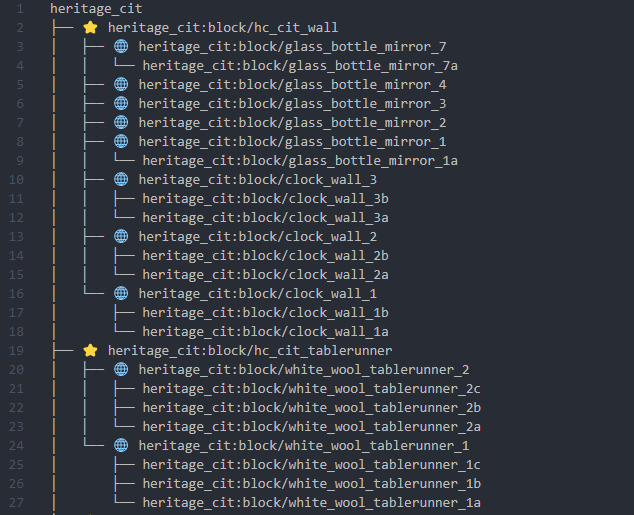

# CIT_TO_IA

Программа, обрабатывающая модели из CIT-ресурспаков Minecraft для добавления их в виде предметов ItemsAdder.

- Исправляет относительные пути в `parent` на пути вида `namespace:item/model`
- Генерирует файл с кодом добавления всех моделей для ItemsAdder
- Дополнительно генерирует текстовый файл с деревом наследования моделей с метками наличия полей `display` и `elements` (полезно для последующего редактирования отображения моделей)
    

## Установка

Стандартный процесс - клонируем репозиторий, устанавливаем через [`poetry install`](https://python-poetry.org/)

## Использование

- Перенести файлы моделей из CIT-ресурспака в обычный.

- ```
    cittoia путь_к_папке_models
    ```

Дополнительные аргументы:

| Аргумент                 | Описание                                        | По умолчанию                       |
| ------------------------ | ----------------------------------------------- | ---------------------------------- |
| --ia_configs_output_path | Путь сохранения файла конфигурации ItemsAdder   | items.yml относительно models      |
| --tree_output_path       | Путь сохранения файла с деревом зависимостей    | model_tree.yml относительно models |
| --display_mark           | Метка в дереве перед моделями с `display`       | ⭐                                  |
| --elements_mark          | Метка в дереве перед моделями с `elements`      | 🌐                                  |
| --material               | Материал предметов в ItemsAdder                 | IRON_INGOT                         |
| --lore                   | Описание предметов в ItemsAdder. `\n` - перенос |                                    |
| --category_name          | Название категории в ItemsAdder                 | пространство имён ресурспака       |